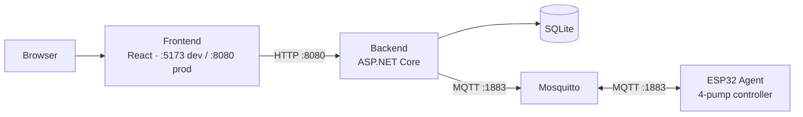

# cocktailmaker

Recipe management and drink dispensing. Runs on a Raspberry Pi — manages cocktail recipes and controls ESP32-based pump dispensers over MQTT.

## Architecture



Full documentation: [docs/architecture.md](docs/architecture.md) · [docs/requirements.md](docs/requirements.md)

## Quick Start

```bash
# Backend + broker (dev mode)
cd src && docker-compose up

# Frontend with live reload (separate terminal)
cd src/frontend && npm run dev
```

Open `http://localhost:5173`. See [docs/development.md](docs/development.md) for dev vs production details.

## Contributing

All changes go through a PR — see [AGENTS.md](AGENTS.md) for workflow and roadmap.

| Rule | Value |
|------|-------|
| Branch | `feature/<description>` or `hotfix/<description>` |
| Commits | [Conventional Commits](https://www.conventionalcommits.org/) (`feat:`, `fix:`, `chore:` …) |
