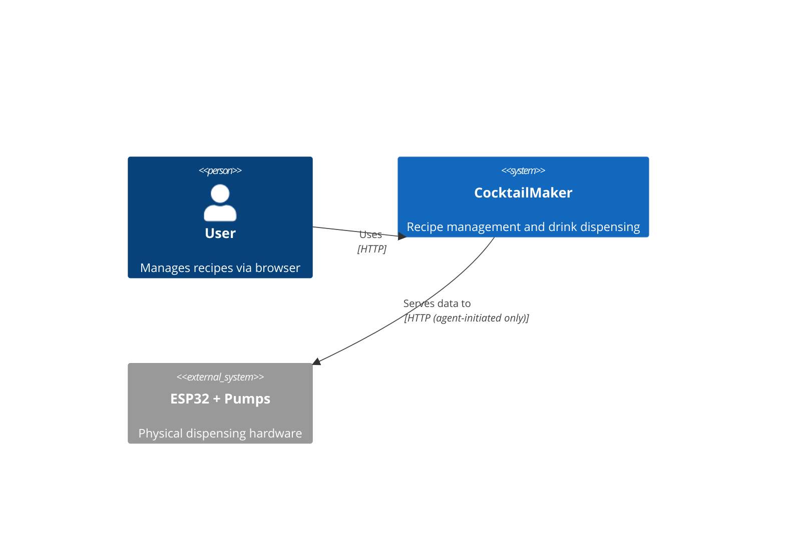
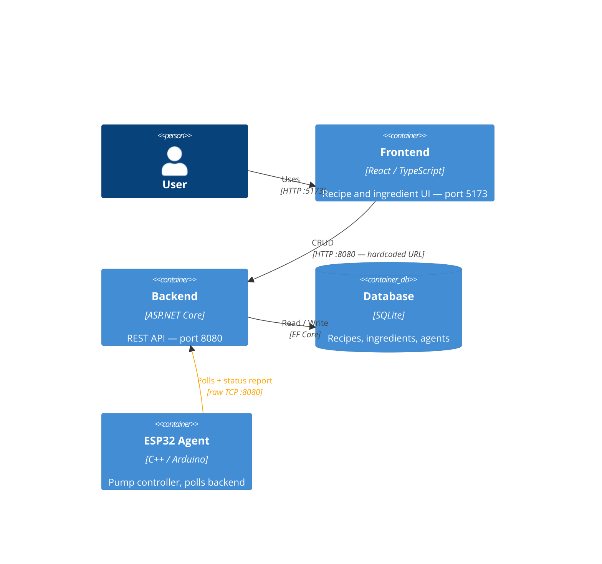
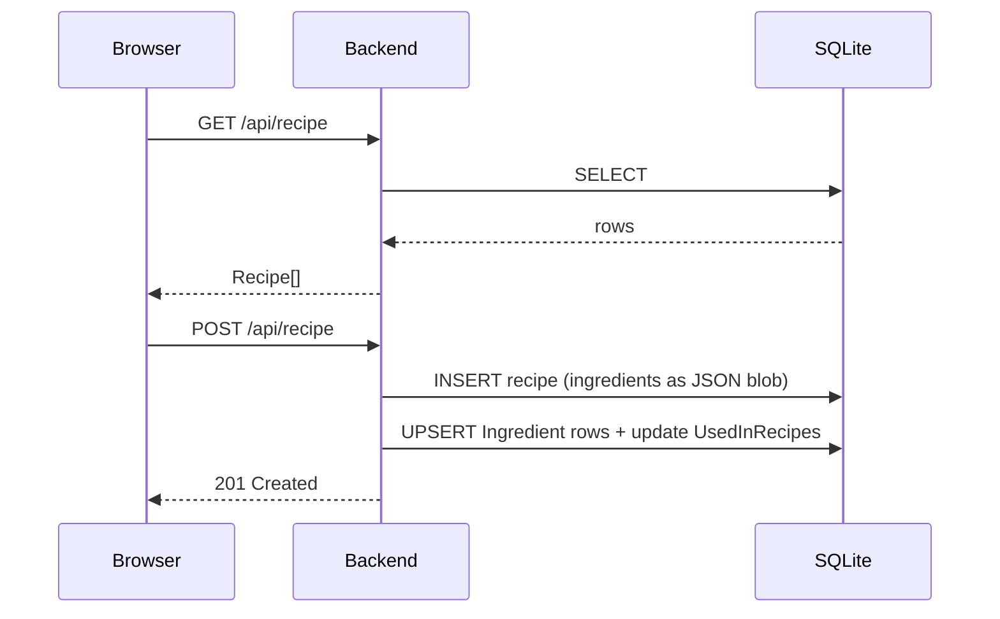
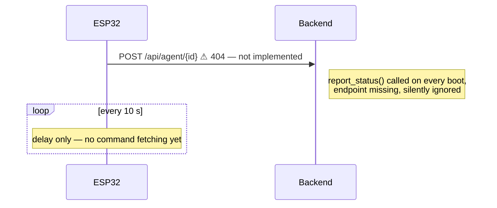
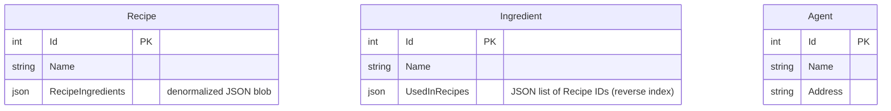

# Architecture

## System Context

## Containers

> **One-way only.** The backend has no path to reach the ESP32. All communication is agent-initiated.

---

## Communication Flows

### Recipe CRUD

### ESP32 Boot + Poll

---

## Data Model

`Recipe.RecipeIngredients` and `Ingredient.UsedInRecipes` are **denormalized mirrors** — no join table, no DB constraint. Application code in `RecipeController` keeps them in sync on every write.

---

## Known Mismatches

| # | Location | Expected | Actual |
|---|----------|----------|--------|
| 1 | `AgentController` | Query `Agents` table | Hardcoded in-memory list; DB table exists and is seeded but never read |
| 2 | `APIClient::report_status()` | `POST /api/agent/{id}` responds | Endpoint not implemented — 404 on every boot, return value ignored |
| 3 | `Program.cs` | OpenAPI available in development | Registered only in `!IsDevelopment` |
| 4 | `main.cpp` loop | Fetch and process commands | `delay(10000)` only — polling not implemented |
| 5 | `api_client.h` | Use `HTTPClient` Arduino library | Raw TCP string construction over `WiFiClient` |
