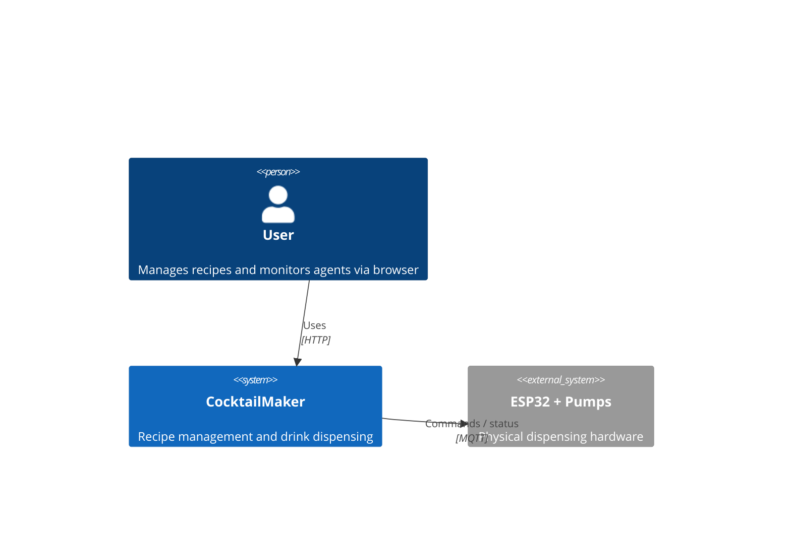
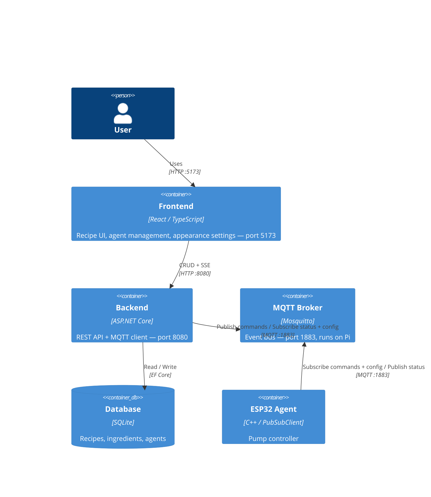
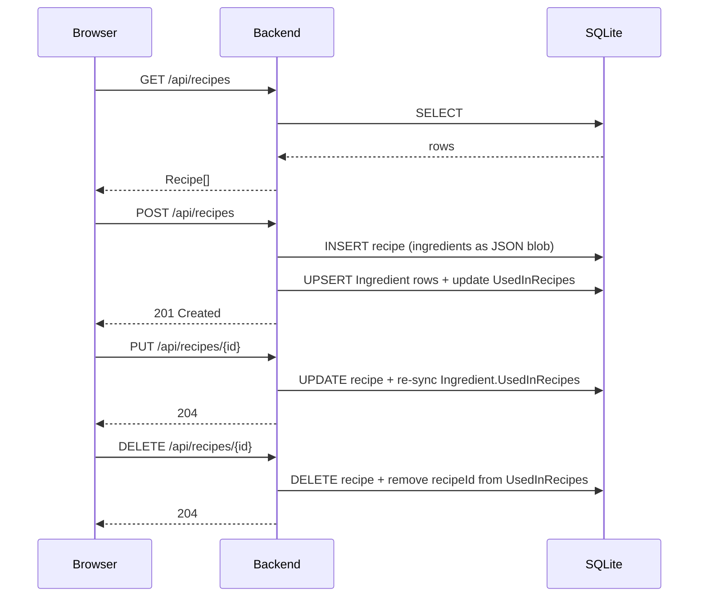
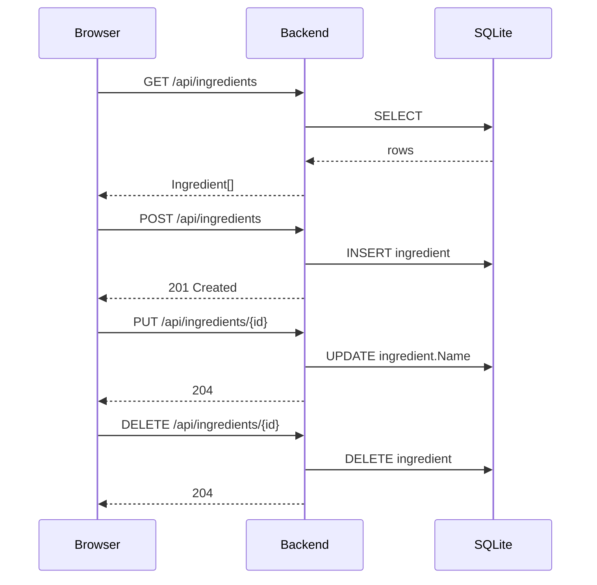
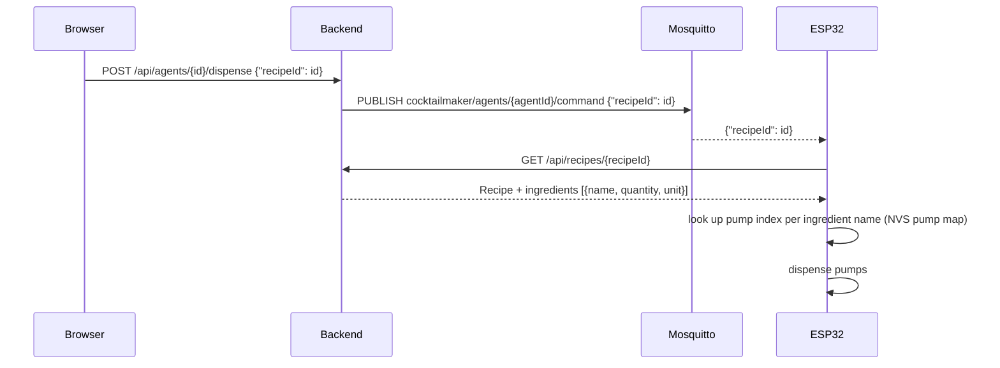
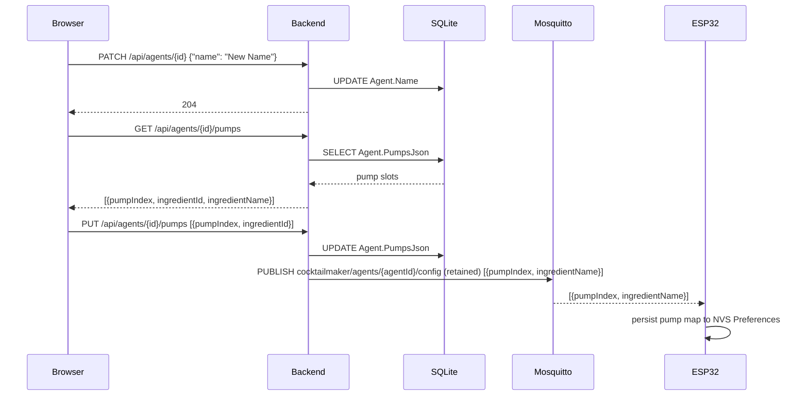
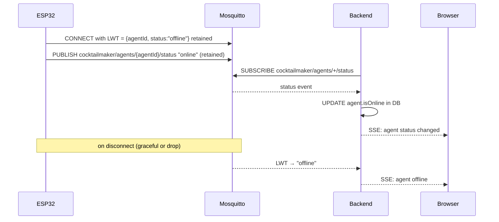
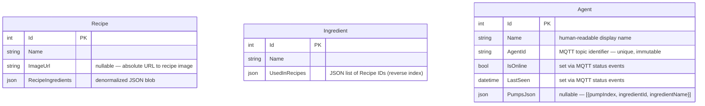

# Architecture

## System Context

## Containers

> **Network:** Pi is the WiFi access point. Frontend, backend, broker, and all agents share the same LAN. No internet dependency.

---

## Communication Flows

### Recipe CRUD (Frontend → Backend)

### Ingredient CRUD (Frontend → Backend)

### Dispense command

### Agent pump configuration

> **First-boot fallback:** if an ESP32 has no NVS pump map (fresh flash, broker unreachable), dispense falls back to positional assignment (ingredient index 0 → pump 0).

### Agent health monitoring

---

## Data Model

`Recipe.RecipeIngredients` and `Ingredient.UsedInRecipes` are **denormalized mirrors** — no join table, no DB constraint. `RecipeController` keeps them in sync on every write.

`Agent.PumpsJson` follows the same denormalized pattern — pump-ingredient mapping stored as a JSON blob, synced to the ESP32 via retained MQTT on every write.

---

## Known Mismatches

| # | Description | Location | Planned fix |
|---|-------------|----------|-------------|
| 1 | Appearance preferences (display mode, header style, font, background image URL) are client-only — persisted in `localStorage`, no backend/API involved. Runtime theming applied by setting inline CSS vars on `document.documentElement`. | `src/frontend/src/components/settings/AppearanceSettings.tsx` | Accepted; no backend persistence planned |
| 2 | `Recipe.ImageUrl` column added via raw `ALTER TABLE` in `EnsureSchema()` at startup, not via EF migrations (project has no migration history). Safe to run repeatedly; exception swallowed when column already exists. | `src/backend/Program.cs` | Accepted; migrate to EF migrations if schema evolution continues |
