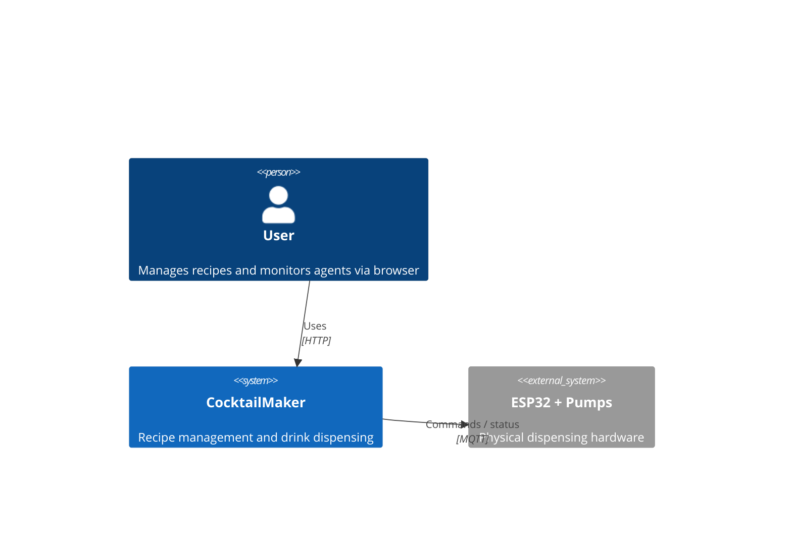
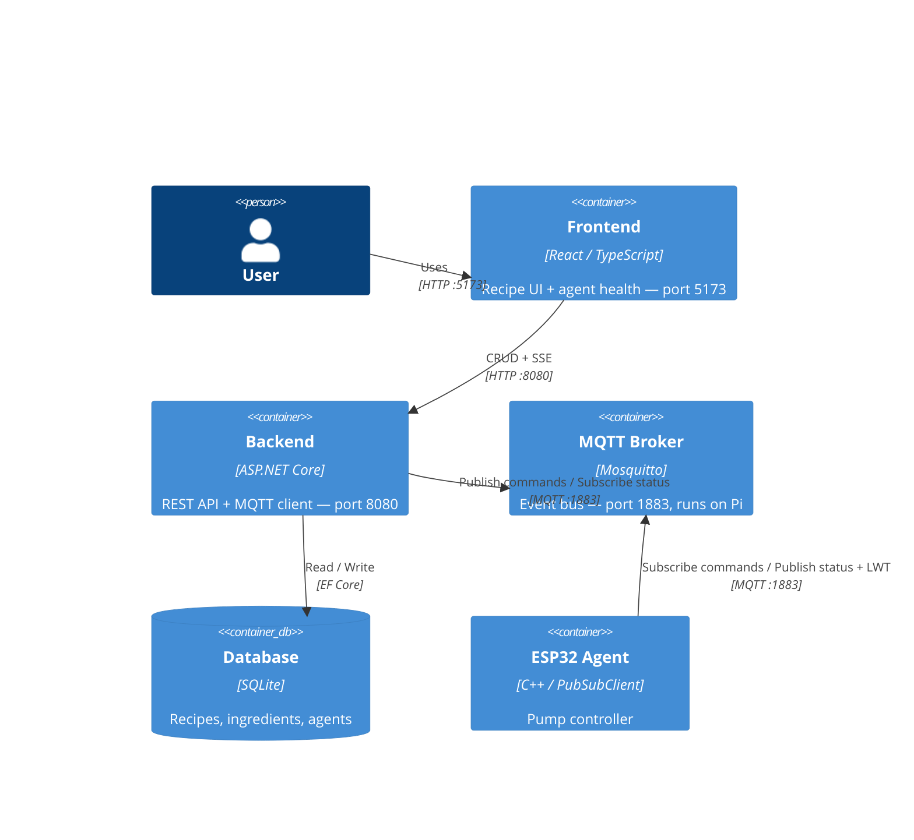
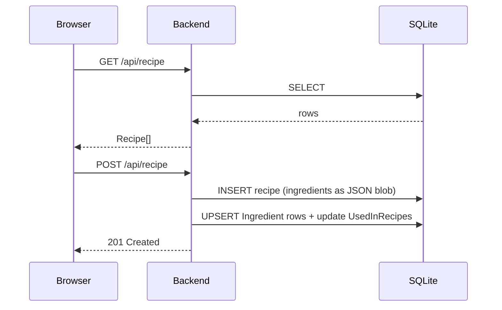
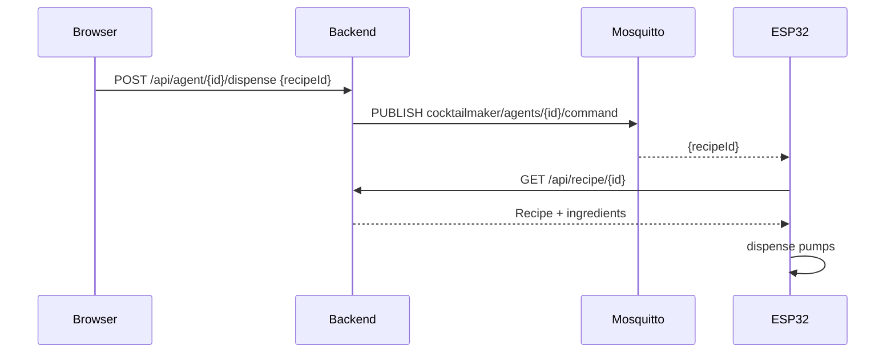
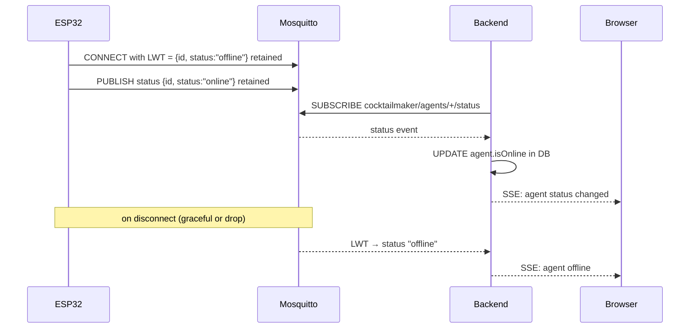
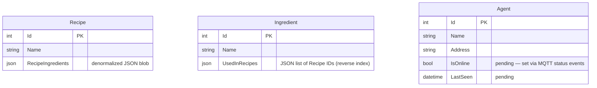

# Architecture

## System Context

## Containers

> **Network:** Pi is the WiFi access point. Frontend, backend, broker, and all agents share the same LAN. No internet dependency.

---

## Communication Flows

### Recipe CRUD (Frontend → Backend)

### Dispense command (Browser → Backend → Agent)

### Agent health monitoring (LWT + SSE)

---

## Data Model

`Recipe.RecipeIngredients` and `Ingredient.UsedInRecipes` are **denormalized mirrors** — no join table, no DB constraint. `RecipeController` keeps them in sync on every write.

---

## Known Mismatches

| # | Location | Expected | Actual |
|---|----------|----------|--------|
| 1 | `AgentController` | Query `Agents` table | Hardcoded in-memory list |
| 2 | `APIClient::report_status()` | Status via MQTT LWT | HTTP POST to missing endpoint |
| 3 | `Program.cs` | OpenAPI in development | Registered only in `!IsDevelopment` |
| 4 | `main.cpp` loop | MQTT subscription callback | `delay(10000)` only |
| 5 | `api_client.h` | `PubSubClient` for MQTT | Raw TCP `WiFiClient` |
